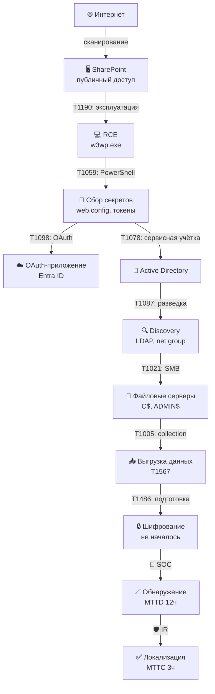
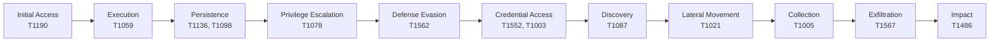
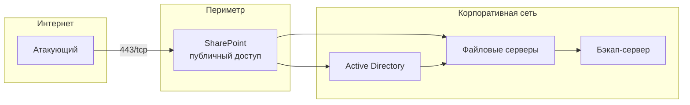
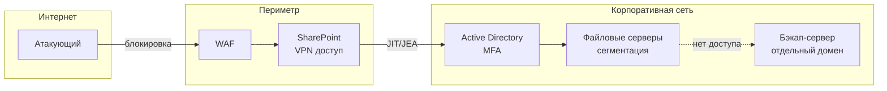

# Карта инцидента

## Цепочка атаки



## Тактики ATT&CK



## Временная шкала

```mermaid
timeline
    title Хронология инцидента
    section 03 января
        23:41 : Сканирование сервиса
    section 04 января
        00:05 : Эксплуатация уязвимости
        00:18 : Первый дочерний процесс
        01:48 : Создание учётной записи
        02:15 : OAuth-приложение
        08:10 : Первая выгрузка данных
        12:00 : Обнаружение SOC
        12:20 : Локализация
    section 05-07 января
        : Восстановление
        : Ротация секретов
        : Post-mortem
```

## Сеть до инцидента



## Сеть после улучшений


